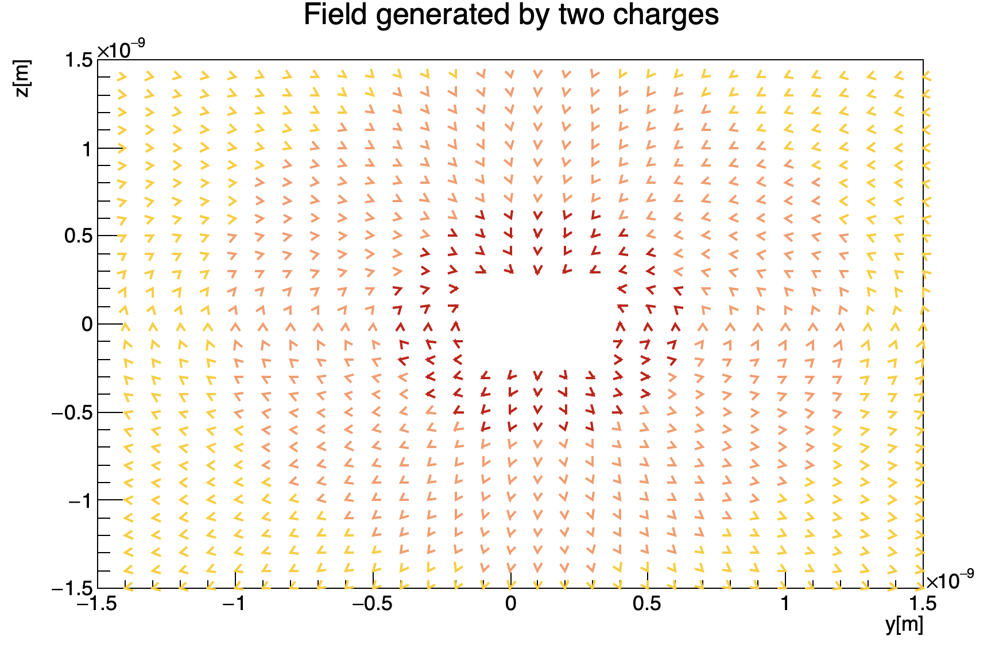
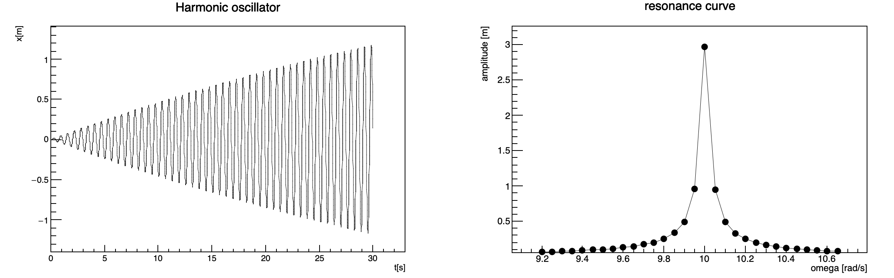
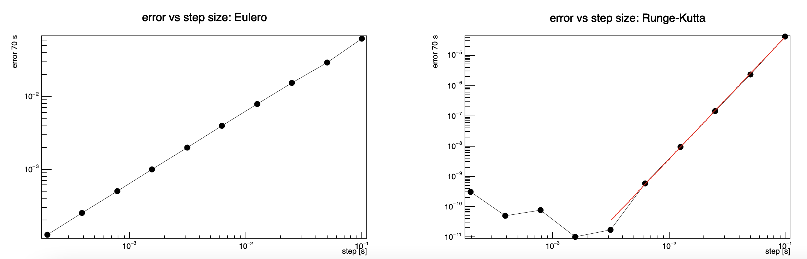

# Numerical methods to solve physical and mathematical problems

This repository contains C++ classes with the respective examples in order to solve different numerical problems, related both to physics and math itself.

ROOT Cern installation is required to run the code. 

## Electric field generated by a dipole with ROOT-Cern
In `dipole_electric_field` we generate an electric dipole made up by a proton and an electron separated by a distance of an amstrong. Given the position of the dipole, the code computes the trend of the electric field generated as a function of the distance from the dipole. Moreover, we provide the plot of the corresponding field as in figure below:

 

## Root-finding: bisection method 
The folder `root_finding` provides a class solver and the corresponding method bisection to compute the root of a given function. In particular, functions can be implemented by inheriting from the abstract class `funcbase` and implementing the specific method `eval`. 
The provided example in `main` finds the roots of the function f(x) = 3x2+5x-2. To do so, it receives from command line the extremes of the interval and the desired precision.

## Integrals: mid-point, Simpson, trapezoid methods
The folder `integrals` provides a class integral and the corresponding methods to compute the integral of a given function, functions should be implemented as classes inheriting from `funcbase`. We implemented the following methods: mid-point, Simpson, trapezoid, each of which is available both with fixed precision and with fixed number of iterations.
The example in `main` computes the integral of the function sin(x) in [0,π]. 

## Differential equations: Euler, Runge-Kutta methods
The folder `diff_equations` provides three examples of usage of Euler and Runge-Kutta methods in physical problems. In particular, we provide a graphical solution to the simple armonic oscillator problem, and to the oscillator in presence of an external force. 

An example of solution to the harmonic oscillator with an external force is shown in figure below:

 

While the comparison between the two methods is shown in figure below:

 

## Montecarlo integrals: mean, hit or miss methods

- 
Scrivere un programma che produca quattro istogrammi contenenti ciascuno 10000 numeri pseudo-casuali estratti da :
una distribuzione uniforme tra 5 e 10.
una distribuzione esponenziale tra 0 e + ∞ con costante k=1.
una distribuzione gaussiana centrata in 1 e larghezza 1 con il metodo di Box-Muller.
una distribuzione gaussiana centrata in 1 e larghezza 1 con il metodo accept-reject.

- Generare una serie di numeri casuali uniformemente distribuiti in [0,1] e calcolare la somma eseguita su un numero n di elementi consecutivi della serie generata. Calcolare la varianza della serie di numeri generata e della serie delle somme. Verificare che questa scala con n. Passare da riga di comando sia il numero di elementi della serie di partenza (10000 può essere un buon numero) ed il numero di elementi su cui fare la somma. Creare due istogrammi che contengano la distribuzione dei numeri generata e la distribuzione delle somme. Verificare come cambia la distribuzione delle somme al variare di n.

- Calcolare 10000 volte il valore dell'integrale di sin(x) tra [0,π] utilizzando il metodo della media a 100 punti e fare un grafico ( istogramma ) della distribuzione dei valori ottenuti.
Estendere il punto precedente calcolando 10000 volte il valore dell'integrale di sin(x) tra [0,π] utilizzando il metodo della media a N punti con N pari a 100, 500, 1000, 5000, 10000 punti. Per ogni valore di N produrre il grafico della distribuzione dei 10000 valori ottenuti. [NOTA: poichè il calcolo degli integrali con N molto elevato potrebbe richiedere un certo tempo, potrebbe essere utile salvare in diversi files i valori degli integrali calcolati per un determinato N e svolgere i punti successivi con un secondo programma che utilizzi come input i files di integrali del programma precedente.]
Stimare l'errore sul calcolo dell'integrale a 100, 500, 1000, 5000, 10000 punti come deviazione standard dei 10000 valori calcolati per ogni N. Far un grafico di questo errore in funzione di N.
Assumendo che l'andamento dell'errore sia noto ( del tipo k/ √N ) si determini quanti punti sono necessari per ottenere una precisione di 0.001. Si ripeta lo stesso lavoro con il metodo hit-or-miss.

-multidim

