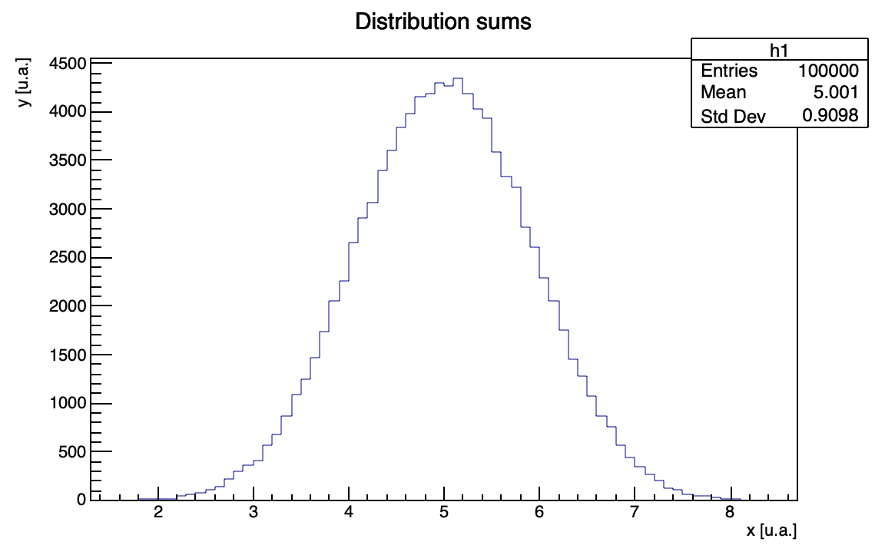

# Numerical methods to solve physical and mathematical problems

This repository contains C++ classes with the respective examples in order to solve different numerical problems, related both to physics and math itself.

ROOT Cern installation is required to run the code. 

## Electric field generated by a dipole with ROOT-Cern
In `dipole_electric_field` we generate an electric dipole made up by a proton and an electron separated by a distance of an amstrong. Given the position of the dipole, the code computes the trend of the electric field generated as a function of the distance from the dipole. Moreover, we provide the plot of the corresponding field as in figure below:

 

## Root-finding: bisection method 
The folder `root_finding` provides a class solver and the corresponding method bisection to compute the root of a given function. In particular, functions can be implemented by inheriting from the abstract class `funcbase` and implementing the specific method `eval`. 
The provided example in `main` finds the roots of the function f(x) = 3x2+5x-2. To do so, it receives from command line the extremes of the interval and the desired precision.

## Integrals: mid-point, Simpson, trapezoid methods
The folder `integrals` provides a class integral and the corresponding methods to compute the integral of a given function, functions should be implemented as classes inheriting from `funcbase`. We implemented the following methods: mid-point, Simpson, trapezoid, each of which is available both with fixed precision and with fixed number of iterations.
The example in `main` computes the integral of the function sin(x) in [0,π]. 

## Differential equations: Euler, Runge-Kutta methods
The folder `diff_equations` provides three examples of usage of Euler and Runge-Kutta methods in physical problems. In particular, we provide a graphical solution to the simple armonic oscillator problem, and to the oscillator in presence of an external force. 

An example of solution to the harmonic oscillator with an external force is shown in figure below:

 

While the comparison between the two methods on the simple oscillator is shown in figure below:

 

## Montecarlo integrals: mean, hit or miss methods
The folder `montecarlo_integrals` provides examples of how it is possible to compute pseudo-random numbers and how random number generation can be used to compute the integral of a function. 
In particular, we provide different examples:
- random_numbers: code that implements generators for uniform, gaussian (Box-Muller and accept-reject) and exponential distributions;
- central_limit_theorem: code that generates a series of random numbers uniformly distributed in [0,1] and computes the sum over a fixed number of elements, in order to directly verify the central limit theorem;
- integrals: class to solve the integral of a function using Monte Carlo methods: mean and hit-or-miss.
- multi_dim_example: example of usage of the Monte Carlo method of the mean in a multi-dimensional problem.

Central limit theorem verification is shown in figures below.
Summing 2 variables we obtain the following distributions:

 

Summing 10 variables we obtain the following distributions:

 
